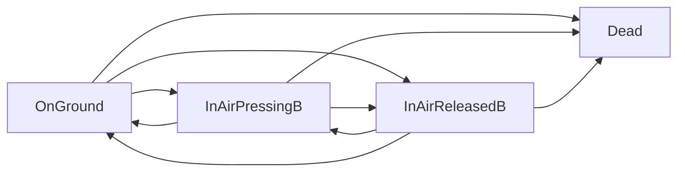

# Notes for Player FSM

* On Ground
  * Jump
  * Fall (Walk off a platform)
* Jumping
  * Pressing Jump Button
  * Released Jump Button

```mermaid
graph LR
  OnGround --> InAirPressingB
  OnGround --> InAirReleasedB
  InAirPressingB --> OnGround
  InAirPressingB --> InAirReleasedB
  InAirReleasedB --> InAirPressingB
  InAirReleasedB --> OnGround
  OnGround --> Dead
  InAirPressingB --> Dead
  InAirReleasedB --> Dead
```
